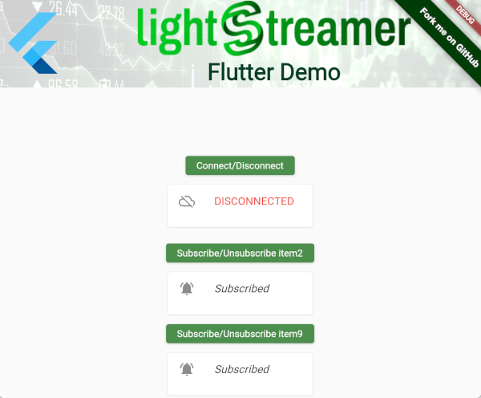

# Lightstreamer-example-StockList-client-flutter

This project includes a demo client showing integration between [Lightstreamer](https://lightstreamer.com/) and [Flutter App Development Toolkit](https://flutter.dev/).
In particular the integration of the Lightstreamer Android Client Library and Lighstreamer iOS Client Library for Android and iOS targets respectively.

 

## Details

This app is a very basic example of integration between Lightstreamer and Flutter, showing the opening and closing of a client session with the server
and the subscription of a couple of Items of the demo StockList to get the real-time data.

## Target Android Platform

The demo targets the Android platform. 
Messages are passed between the client (UI) and host (platform) using platform channels; in particular one [MethodChannel](https://api.flutter.dev/flutter/services/MethodChannel-class.html) and two [BasicMessageChannel](https://api.flutter.dev/flutter/services/BasicMessageChannel-class.html).
The MethodChannel is used to request actions prompted by the UI iteration such as opening and closing the connection with the Lightstreamer server and subscribing and unsubscribing particular Items.

One of the BasicMessageChannel is used to send real-time updates to the UI about the status of the connection with the server.
The second BasicMessageChannel is used to send real-time updates to the UI about Items data.

### Java Code for Android

The Java code implementing these channels is developed in the [MainActivity.java](https://github.com/Lightstreamer/Lightstreamer-example-StockList-client-flutter/blob/main/android/app/src/main/java/com/lightstreamer/flutter_example/MainActivity.java).
The MethodChannel `com.lightstreamer.flutter/LightstreamerClient` defines three methods: 
 - *connect* to call [LightstreamerClient.connect](https://sdk.lightstreamer.com/ls-android-client/4.2.5/api/com/lightstreamer/client/LightstreamerClient.html#connect--) in case there is not already an active client session.
 - *disconnect* to call [LightstreamerClient.connect](https://sdk.lightstreamer.com/ls-android-client/4.2.5/api/com/lightstreamer/client/LightstreamerClient.html#disconnect--) in case there is already an active client session. 
 - *subscribe* to call [LightstreamerClient.subscribe](https://sdk.lightstreamer.com/ls-android-client/4.2.5/api/com/lightstreamer/client/LightstreamerClient.html#subscribe-com.lightstreamer.client.Subscription-) if the items argument is not already subscribed, in which case [LightstreamerClient.unsubscribe](https://sdk.lightstreamer.com/ls-android-client/4.2.5/api/com/lightstreamer/client/LightstreamerClient.html#unsubscribe-com.lightstreamer.client.Subscription-) is instead called.

The BasicMessageChannel `com.lightstreamer.flutter.clientStatus_channel` is used to send update messages on the status of the connection with the server, basically the events of this listener: [onStatusChange](https://sdk.lightstreamer.com/ls-android-client/4.2.5/api/com/lightstreamer/client/ClientListener.html#onStatusChange-java.lang.String-)

The BasicMessageChannel `com.lightstreamer.flutter.realtime_channel` is used to send update messages related to items updates, basically the events of this listener: [onItemUpdate](https://sdk.lightstreamer.com/ls-android-client/4.2.5/api/com/lightstreamer/client/SubscriptionListener.html#onItemUpdate-com.lightstreamer.client.ItemUpdate-)

### Getting Started

You can build and run the demo with [Android Studio](https://developer.android.com/studio).
Just open the `android` folder from Android Studio and press `Run 'app'`.

## Target iOS Platform

Coming soon.

## See Also

### Lightstreamer Adapters Needed by This Demo Client

* [Lightstreamer - Stock- List Demo - Java Adapter](https://github.com/Lightstreamer/Lightstreamer-example-Stocklist-adapter-java)
* [Lightstreamer - Reusable Metadata Adapters- Java Adapter](https://github.com/Lightstreamer/Lightstreamer-example-ReusableMetadata-adapter-java)

### Related Projects

* [Lightstreamer - Stock-List Demos - HTML Clients](https://github.com/Lightstreamer/Lightstreamer-example-Stocklist-client-javascript)
* [Lightstreamer - Stock-List Demo - iOS Client](https://github.com/Lightstreamer/Lightstreamer-example-StockList-client-ios)
* [Lightstreamer - Stock-List Demo with APNs Push Notifications - iOS Client](https://github.com/Lightstreamer/Lightstreamer-example-MPNStockList-client-ios)
* [Lightstreamer - Stock-List Demo - Android Client](https://github.com/Lightstreamer/Lightstreamer-example-AdvStockList-client-android)
* [Lightstreamer - Stock-List Demo - React Native Client](https://github.com/Lightstreamer/Lightstreamer-example-StockList-client-reactnative)
* [Lightstreamer - Basic Stock-List Demo - OS X Client](https://github.com/Lightstreamer/Lightstreamer-example-StockList-client-osx)
* [Lightstreamer - Basic Stock-List Demo - Electron Client](https://github.com/Lightstreamer/Lightstreamer-example-StockList-client-electron)
* [Lightstreamer - Basic Stock-List Demo - HTML (React) Client](https://github.com/Lightstreamer/Lightstreamer-example-StockList-client-react)

## Lightstreamer Compatibility Notes

* Compatible with [Lightstreamer Android Client SDK](https://search.maven.org/artifact/com.lightstreamer/ls-android-client/4.2.5/jar) 4.2.0 or newer.